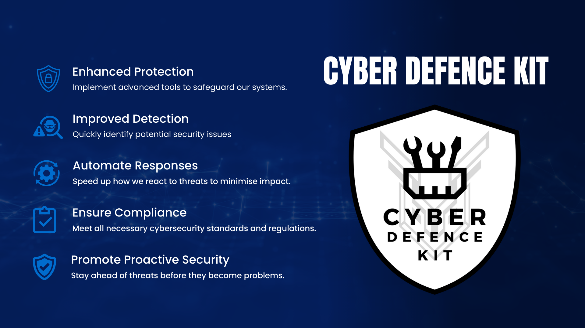

# Cyber Defence Kit Explained

<iframe width="560" height="315" src="https://www.youtube.com/embed/T3NmBjPWuEc?si=XCAchl22yXzsR98e" title="YouTube video player" frameborder="0" allow="accelerometer; autoplay; clipboard-write; encrypted-media; gyroscope; picture-in-picture; web-share" referrerpolicy="strict-origin-when-cross-origin" allowfullscreen></iframe>

## Why is Cybersecurity Important to Us?

In our increasingly digital world, protecting our organisation's information and systems from cyber threats is crucial. Cyber attacks can lead to:

- Loss of Sensitive Data: Confidential information could be stolen.
- Operational Disruptions: Our daily activities might be halted.
- Damage to Reputation: Trust from our clients and partners could diminish.

Real-World Examples:

- Increased Cyber Threats: New Zealand's National Cyber Security Centre (NCSC) has reported a rise in cyber incidents targeting both public and private sectors, including attempts to access sensitive government information.

## What is Cyber Defence Kit?

The Cyber Defence Kit is our initiative to strengthen our defences against cyber threats. We aim to:

- Enhance Protection: Implement advanced tools to better safeguard our systems.
- Improve Detection: Quickly identify potential security issues.
- Automate Responses: Speed up how we react to threats to minimise impact.
- Ensure Compliance: Meet all necessary cybersecurity standards and regulations.
- Promote Proactive Security: Stay ahead of threats before they become problems.

## How Will We Achieve This?

We plan to introduce several tools and practices:

1. Advanced Monitoring Systems:
    - Tools that watch over our network to spot unusual activities.
    - They alert us immediately if something suspicious happens.
2. Automated Response Mechanisms:
    - Systems that can automatically take action against certain threats.
    - This speeds up our response time and reduces manual effort.
3. Improved Incident Management:
    - A structured way to handle any security incidents.
    - Ensures we address issues efficiently and learn from them.
4. Enhanced Endpoint Protection:
    - Better security for individual devices like computers and servers.
    - Protects against malware and unauthorized access.
5. Staff Awareness and Support:
    - Providing resources and assistance to help everyone understand these new tools.
    - Encouraging a culture where cybersecurity is everyone's responsibility.

## What Does This Mean for You?

- Safer Work Environment: Reduced risk of cyber attacks affecting your work.
- Better Tools and Support: Access to improved systems that protect your daily activities.
- Peace of Mind: Confidence that our organization's information is secure.
- Compliance Assurance: Knowing we meet industry standards protects us legally and ethically.

## Using Plain Language

- Cyber Threats: Bad activities that try to harm our computer systems or steal information.
- Monitoring Tools: Programs that keep an eye on our systems to ensure everything is normal.
- Automated Responses: Actions taken by our systems without needing manual input when a threat is detected.
- Incident Management: The process we follow when dealing with security problems.
- Endpoint Protection: Security measures for devices like laptops and smartphones.

## Why This Matters

By implementing the Cyber Defence Kit, we are taking important steps to:

- Protect Our Assets: Keeping our information and systems secure.
- Support Our Mission: Ensuring we can carry out our work without disruptions.
- Maintain Trust: Showing our clients and partners that we take security seriously.
- Stay Ahead: Being proactive rather than reactive to cyber threats.

## Summary

Our goal is to create a secure and efficient environment where everyone can perform their best work without worrying about cyber threats. The Cyber Defence Kit project is our commitment to safeguarding our organisation now and in the future.