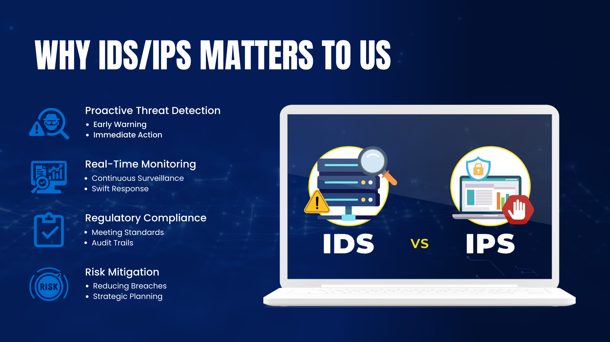
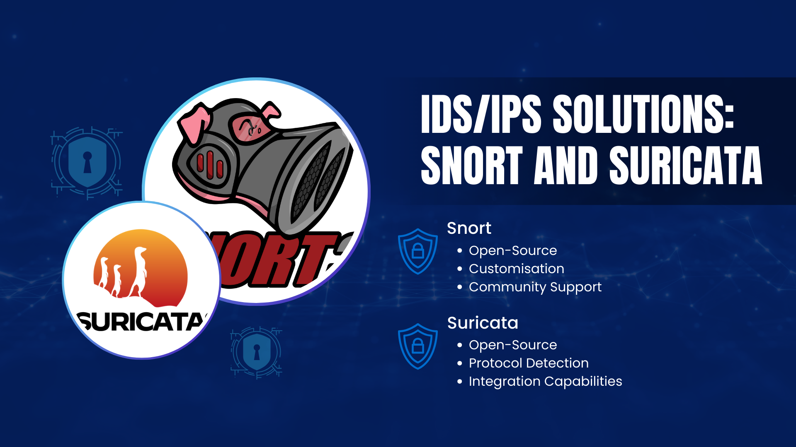

# Understanding IDS/IPS

### **Introduction**

In today's digital world, cybersecurity is more important than ever. Protecting our organisation's information and systems from cyber threats is essential to maintaining our operations, reputation, and the trust of our clients and partners. To strengthen our defenses, we are implementing Intrusion Detection Systems (IDS) and Intrusion Prevention Systems (IPS).

This document explains what IDS and IPS are, why they're important, and how they affect different members of our organisation.

## **What are IDS and IPS?**

**Intrusion Detection Systems (IDS)** and **Intrusion Prevention Systems (IPS)** are cybersecurity technologies designed to monitor network traffic for signs of malicious activity.

- **IDS**: Monitors network traffic and alerts security teams when suspicious activities are detected.
- **IPS**: Not only detects suspicious activities but also takes action to prevent potential threats from causing harm.

### **Why IDS/IPS Matter to Us**

1. **Proactive Threat Detection**
    - **Early Warning**: IDS alerts us to potential security threats before they become serious issues.
    - **Immediate Action**: IPS can block malicious traffic in real-time, preventing attacks.
2. **Real-Time Monitoring**
    - **Continuous Surveillance**: Keeps an eye on network activity around the clock.
    - **Swift Response**: Enables quick action to mitigate threats as they arise.
3. **Regulatory Compliance**
    - **Meeting Standards**: Helps us comply with cybersecurity regulations and industry best practices.
    - **Audit Trails**: Provides detailed logs required for compliance reporting.
4. **Risk Mitigation**
    - **Reducing Breaches**: Helps prevent security incidents that could harm our operations and reputation.
    - **Strategic Planning**: Informs decisions on improving our cybersecurity measures.

### **Benefits of Implementing IDS/IPS**

- **Enhanced Security**: Strengthens our defenses against cyber attacks.
- **Operational Efficiency**: Automates threat detection and prevention, reducing manual efforts.
- **Stakeholder Confidence**: Shows our commitment to security, building trust with clients and partners.
- **Cost Savings**: Prevents costly security breaches and downtime.

### **How IDS/IPS Work**

1. **Traffic Monitoring**: Continuously scans network traffic for unusual patterns or known threat signatures.
2. **Analysis**: Uses rules and algorithms to detect potential threats based on predefined criteria.
3. **Alerting (IDS)**: Sends notifications to the security team when suspicious activity is detected.
4. **Prevention (IPS)**: Automatically blocks or quarantines malicious traffic to prevent damage.

### **Our IDS/IPS Solutions**

- **Snort**
    - **Open-Source IDS/IPS**: Widely used for real-time traffic analysis and packet logging.
    - **Customisation**: Allows us to tailor rules to our specific network environment.
    - **Community Support**: Extensive community and a large repository of rules for threat detection.
- **Suricata**
    - **Open-Source IDS/IPS**: Provides robust intrusion detection and prevention capabilities.
    - **Protocol Detection**: Automatically detects and parses various protocols such as HTTP for deeper inspection.
    - **Integration Capabilities**: Easily integrates with other security tools and platforms, enhancing overall security infrastructure.

### **Support Available**

- **Resources**: We will provide easy-to-understand materials to help you implement IDS/IPS solutions and recognize potential threats.
- **Assistance**: Our cybersecurity team is here to support you with any concerns or issues.

### **Summary**

IDS and IPS are crucial cybersecurity tools that help detect and prevent threats, ensuring the safety of our organisation's assets and reputation. Implementing these systems enhances our security posture, aids in compliance, and demonstrates our commitment to protecting our network. Your participation is essential for the successful integration and management of these systems.

## **Frequently Asked Questions**

### **1. Will implementing IDS/IPS affect my daily work?**

- There should be minimal impact on your daily activities. IDS/IPS operate in the background to enhance network security.

### **2. How do IDS and IPS differ?**

- **IDS** alerts the security team about potential threats but doesn't take action to block them. **IPS** not only detects threats but also takes steps to prevent them from causing harm.

### **3. How do IDS/IPS help with compliance?**

- They provide detailed logs and monitoring required for regulatory compliance, making it easier to meet industry standards and pass audits.

### **4. Can IDS/IPS be used in an air-gapped environment?**

- Yes, IDS/IPS solutions like Snort and Suricata can be deployed in air-gapped networks. We will provide documentation on how to implement these tools without internet connectivity, ensuring your network remains secure and isolated.

### **5. What kind of training will be provided?**

- **Introductory Training Sessions**: We will offer basic training to help you get started with IDS/IPS tools and understand how to use them effectively.
- **Free Training Resources**: Access to online tutorials, guides, and documentation will be provided for further learning at your own pace.

### **6. Who do I contact if I have questions or notice a security issue?**

- Please reach out to the cybersecurity team through the internal support channels for any assistance or to report concerns.