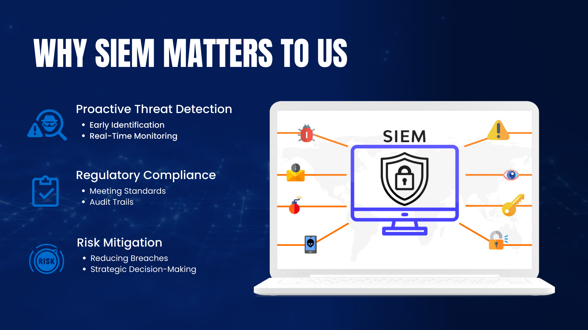
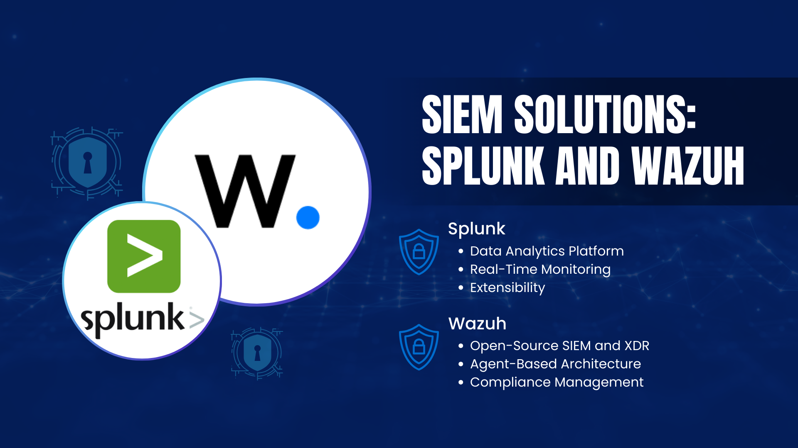

# Understanding SIEM

## Introduction

In today's digital landscape, cybersecurity is more important than ever. Protecting our organisation's information and systems from cyber threats is crucial to maintaining our operations, reputation, and trust with clients and partners. To enhance our defences, we are implementing Security Information and Event Management (SIEM) solutions, focusing on Splunk and Wazuh.
This document explains what SIEM is, why it's important, and how it affects different members of our organisation.

## What is SIEM?

Security Information and Event Management (SIEM) is a technology that provides real-time analysis of security alerts generated by applications and network hardware. SIEM systems collect and analyse security events from various sources within the IT infrastructure to detect anomalies, threats, and compliance issues, giving a centralised view of the organisation's security posture.

## Why SIEM Matters to Us

1. Proactive Threat Detection
      - Early Identification: SIEM enables us to detect potential security incidents before they escalate.
      - Real-Time Monitoring: Continuous surveillance helps us respond swiftly to threats.
2. Regulatory Compliance
      - Meeting Standards: SIEM assists in complying with military cybersecurity standards and other regulations.
      - Audit Trails: Maintains comprehensive logs necessary for audits and compliance reporting.
3. Risk Mitigation
      - Reducing Breaches: Consolidated security events help prevent breaches that could harm operations and reputation.
      - Strategic Decision-Making: Provides insights to inform cybersecurity investments and policies.

## Benefits of Implementing SIEM

- Enhanced Security: Strengthens defenses against sophisticated cyber threats.
- Operational Efficiency: Automates security monitoring, reducing manual efforts.
- Stakeholder Confidence: Demonstrates a commitment to security, bolstering trust.
- Cost Savings: Prevents costly breaches and downtime, safeguarding financial resources.

## How SIEM Works

1. Data Collection: Aggregates logs and events from servers, network devices, applications, and security tools.
2. Normalisation: Converts data into a consistent format for easier analysis.
3. Correlation: Uses rules and algorithms to link related events and identify patterns indicative of security incidents.
4. Alerting and Reporting: Generates real-time alerts and comprehensive reports for security teams.

## Our SIEM Solutions: Splunk and Wazuh

- Splunk
  - Data Analytics Platform: Excels at indexing, searching, and analyzing large volumes of machine-generated data.
  - Real-Time Monitoring: Provides live dashboards and visualizations for immediate insight.
  - Extensibility: Supports a wide range of data inputs and third-party integrations.
- Wazuh
  - Open-Source SIEM and XDR: SIEM and XDR (Extended Detection and Response) offers unified security monitoring and endpoint detection capabilities.
  - Agent-Based Architecture: Deploys agents on endpoints for detailed data collection and active response.
  - Compliance Management: Includes built-in checks for regulatory standards.

## Support Available

- Resources: We will provide easy-to-understand materials to help you implement SIEM solutions and recognize potential threats.
- Assistance: Our cybersecurity team is here to support you with any concerns or issues.

## Summary

SIEM is a cybersecurity tool that enhances security, ensures compliance, and protects our organisation's assets and reputation. SIEM systems like Splunk and Wazuh provide powerful capabilities for detecting and responding to security threats. Your technical expertise is crucial for the successful integration and ongoing management of these systems.

## Frequently Asked Questions

### 1. Will the SIEM implementation affect my daily work?

No significant changes are expected in your daily activities. SIEM operates in the background to enhance security.

### 2. How does SIEM help with compliance?

SIEM systems maintain detailed logs and audit trails required for regulatory compliance, making it easier to meet and demonstrate adherence to standards.

### 3. Is it possible to install SIEM solutions in an air-gapped environment?

Yes, SIEM solutions like Splunk and Wazuh can be installed in air-gapped environments. We will provide documentation that explains how to implement these tools without internet connectivity, ensuring your network remains secure and isolated.

### 4. What kind of training will be provided?

- Introductory Training Sessions: We will offer beginner-level training to help you get started with the SIEM tools and understand the basics of configuring and using them.
- Free Training Resources: For more in-depth learning, we will provide access to free online training materials, tutorials, and documentation that you can explore at your own pace.

### 5. Who do I contact if I have questions or notice a security issue?

Reach out to the cybersecurity team via the internal support channels for assistance or to report concerns.